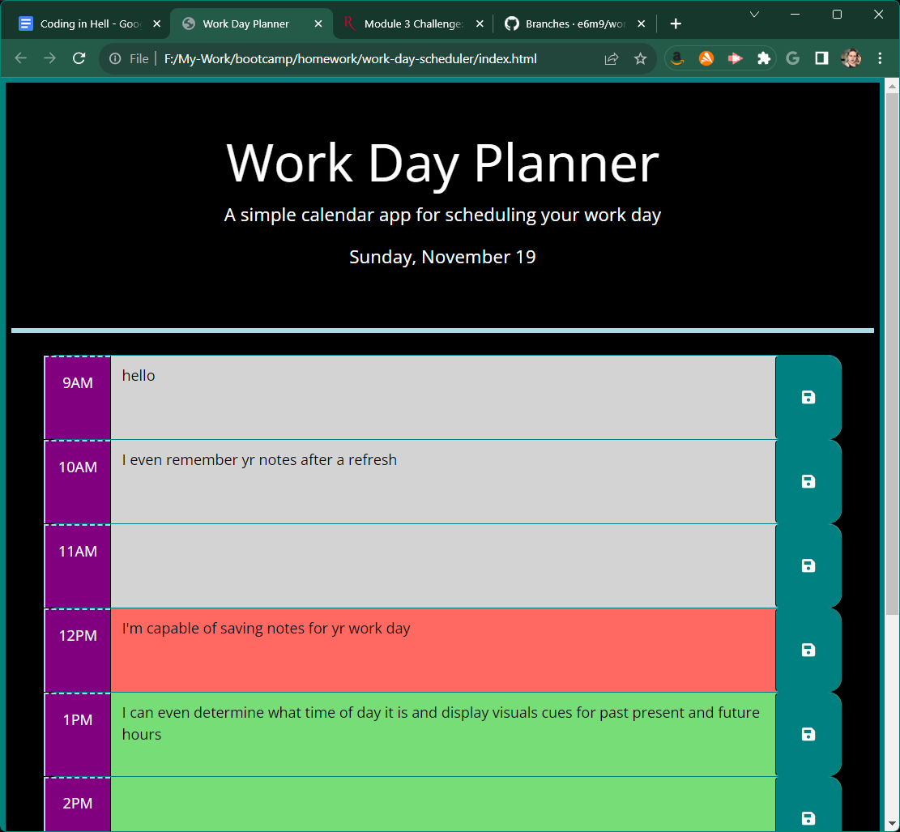

# Workday Planner

# Description

An interactive workday planner made with 3rd Party APIs including Bootstrap and dayJS that saves your notes and keeps track of the current hour

# Usage

To schedule a workday and make note of persistent events while keeping track of the time.

[link-to-site](https://e6m9.github.io/work-day-scheduler)